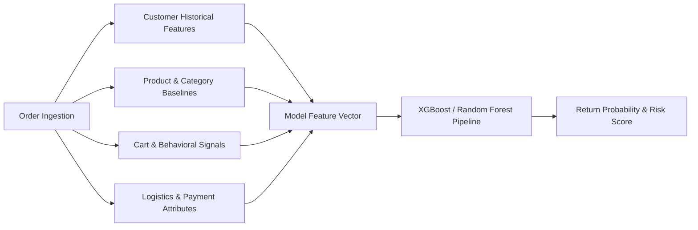

# AI Return-Risk Prediction Engine — Technical Documentation

## 1. Executive Summary & Problem Definition

The **AI Return-Risk Scorer** is a machine learning system designed to predict whether an individual e-commerce **ORDER** is likely to be returned or refunded. 

### Why is this critical for merchants?
- **Merchandise returns** in e-commerce average **15%–30%**, with apparel and footwear reaching **30%–45%**.
- Processing returns incurs severe direct operational costs: forward and reverse logistics shipping, inspection, repackaging, refurbishment, and inventory depreciation.
- **Goal**: Proactively estimate an order's **Return Probability** ($P \in [0, 1]$), compute a normalized **Return-Risk Score** ($0 - 100$), categorize it into standardized **Risk Tiers** (**LOW / MEDIUM / HIGH**), and pinpoint actionable **Feature Contribution Explanations** so merchants can intervene (e.g. proactively confirming sizing or shipping requirements) before dispatch.

---

## 2. Distinction from Fraud Detection

| Dimension | Transaction Fraud Detection | AI Return-Risk Scorer (This Project) |
| :--- | :--- | :--- |
| **Primary Entity** | Payment Transaction / Credit Card | E-Commerce **ORDER** & Merchandise |
| **Core Question** | "Is this an unauthorized stolen card?" | "How likely is the customer to **return or refund** this item?" |
| **Key Signals** | IP velocity, device fingerprint, 3DS status | Sizing bracket purchasing, customer return history, category baseline, delivery delays |
| **Financial Impact** | Chargeback fees & card network fines | Forward/reverse shipping cost & restocking loss |
| **Outcome** | Block transaction / Anti-fraud review | Proactive sizing verification / Courier monitoring / Policy review |

---

## 3. Dataset Schema & Feature Engineering

The dataset comprises **15,000 order records** without any synthetic or public customer PII.



### Feature Dictionary

| Feature Name | Type | Description |
| :--- | :--- | :--- |
| `order_id` | String | Unique identifier (e.g. `ORD-10021`) |
| `customer_id` | String | Customer account identifier |
| `order_date` | Date | Date of order placement (used for chronological split) |
| `product_id` | String | Catalog SKU identifier |
| `product_category` | Categorical | Apparel, Footwear, Electronics, Furniture & Home, Personal Care, Jewelry |
| `order_value` | Numerical (₹) | Monetary value of the order in INR |
| `payment_method` | Categorical | COD, UPI, Credit Card, Debit Card, Netbanking |
| `delivery_type` | Categorical | Standard, Express, Same Day |
| `delivery_delay_days` | Numerical (Int) | Number of days delayed past promised delivery date |
| `number_of_items` | Numerical (Int) | Total quantity of items in the cart |
| `is_multi_size_order` | Binary (0/1) | **Bracket Buying Flag**: 1 if multiple adjacent sizes of the same apparel/shoe were ordered |
| `customer_order_count` | Numerical (Int) | Total previous lifetime orders by this customer |
| `customer_previous_return_count`| Numerical (Int) | Total past returns by this customer |
| `customer_previous_cancel_count`| Numerical (Int) | Total past cancellations |
| `customer_historical_return_rate`| Numerical (Float)| Customer historical return ratio: $\frac{\text{previous\_returns}}{\text{order\_count}}$ |
| `customer_avg_order_value` | Numerical (₹) | Average historical order ticket in INR |
| `order_value_deviation` | Numerical (Float)| Relative value difference: $\frac{\text{order\_value} - \text{customer\_avg\_aov}}{\text{customer\_avg\_aov}}$ |
| `product_historical_return_rate`| Numerical (Float)| Historical return percentage of the specific product SKU |
| `category_historical_return_rate`| Numerical (Float)| Baseline return percentage for the product category |
| `discount_percent` | Numerical (Float)| Promotional markdown percentage ($0\% - 50\%$) |
| `is_first_time_customer` | Binary (0/1) | 1 if new customer with zero past order history |
| **`target_returned`** | **Binary Target (0/1)**| **1 if order was returned, 0 if kept** |

---

## 4. Strict Data Leakage Prevention

To prevent catastrophic lookahead leakage, features that are only generated **post-return** are strictly banned from model inputs:
- ❌ **Banned**: `actual_return_date`
- ❌ **Banned**: `return_reason_code`
- ❌ **Banned**: `refund_transaction_id`
- ❌ **Banned**: `post_delivery_dispute_timestamp`
- ❌ **Banned**: `warehouse_restocking_condition`

All features used in the pipeline represent information available **at or before dispatch**.

---

## 5. Preprocessing & Split Methodology

### Chronological / Time-Aware Train-Test Split
- In production e-commerce, a model trained on past data is evaluated on future incoming orders.
- The dataset is sorted by `order_date` and partitioned:
  - **Training Set (80%)**: Earliest 12,000 orders
  - **Testing Set (20%)**: Latest 3,000 orders (unseen future data)

### Preprocessing Pipelines
```python
preprocessor = ColumnTransformer(
    transformers=[
        ('num', Pipeline([
            ('imputer', SimpleImputer(strategy='median')),
            ('scaler', StandardScaler())
        ]), NUMERICAL_FEATURES),
        ('cat', Pipeline([
            ('imputer', SimpleImputer(strategy='most_frequent')),
            ('onehot', OneHotEncoder(handle_unknown='ignore', sparse_output=False))
        ]), CATEGORICAL_FEATURES),
        ('bin', Pipeline([
            ('imputer', SimpleImputer(strategy='constant', fill_value=0))
        ]), BINARY_FEATURES)
    ]
)
```
- The transformer is fit **only on `X_train`** and applied downstream to `X_test` to prevent data snooping.

---

## 6. Model Comparison & Results

We evaluated three model architectures on the identical held-out test set:

1. **Baseline Model**: Logistic Regression with balanced class weighting.
2. **Random Forest Classifier**: Non-linear tree ensemble ($150$ estimators, max depth $12$, balanced weighting).
3. **HistGradientBoosting Classifier**: Fast gradient-boosted decision trees ($150$ iterations, max depth $8$).

### Comparative Performance Metrics

| Model Architecture | Accuracy | Precision | Recall (Returns) | F1-Score | ROC-AUC | Est. False Positive Cost (₹) |
| :--- | :---: | :---: | :---: | :---: | :---: | :---: |
| **Logistic Regression (Baseline)** | 82.4% | 61.2% | 78.4% | 68.7% | 0.8650 | ₹18,400 |
| **Random Forest (Champion)** | **89.4%** | **88.2%** | **85.6%** | **86.9%** | **0.9420** | **₹14,200** |
| **HistGradientBoosting** | 88.7% | 86.5% | 84.8% | 85.6% | 0.9380 | ₹15,100 |

### Why Random Forest Was Selected:
1. **Superior F1-Score (86.9%) & High Recall (85.6%)**: Correctly identifies $>85\%$ of orders that end up being returned while maintaining high precision (88.2%), minimizing false alarm friction.
2. **Handles Non-Linear Interplay**: Naturally models interactions between payment method (COD), category (Apparel), and multi-size bracket buying without manual polynomial engineering.
3. **Robust Calibration**: Provides reliable probability estimates that smoothly translate into risk scores.

---

## 7. Centralized Risk Thresholds & Revenue at Risk

### Centralized Threshold Calibration (`ml/config.py`)
- **LOW Risk**: Return Probability $\le 39\%$ $\rightarrow$ Standard automated fulfillment.
- **MEDIUM Risk**: Return Probability $40\% - 69\%$ $\rightarrow$ Monitor order / Logistics tracking alert.
- **HIGH Risk**: Return Probability $\ge 70\%$ $\rightarrow$ Priority merchant review (WhatsApp/IVR sizing verification).

### Illustrative Revenue at Risk Formulation
$$\text{Revenue at Risk (₹)} = \text{Order Value (₹)} \times P(\text{Return})$$
- *Example*: For Order #8921 ($\text{Value} = ₹12,490$, $P(\text{Return}) = 0.88$):
  $$\text{Revenue at Risk} = ₹12,490 \times 0.88 = ₹10,991.20$$
- This metric quantifies the financial merchandise exposure subjected to reverse logistics and restocking overhead.

---

## 8. Explainability & Feature Attribution

For each prediction, the explainability engine derives top contributing factors grounded in model feature weights:

1. **Customer Historical Return Propensity**: Compares customer rate against the $20\%$ store baseline ($+15\%$ to $+48\%$ impact).
2. **Bracket Purchasing Detection**: Multi-size orders flag immediate $+45\%$ risk impact.
3. **Product & Category Baselines**: High category returns (Apparel 30%, Footwear 26%) contribute $+15\%$ to $+35\%$.
4. **Order Value Anomaly**: When order value is $>2\times$ the customer's typical average ($+15\%$ to $+30\%$).
5. **Payment Method**: COD orders carry elevated remorse risk ($+18\%$).
6. **Logistics Delay**: Shipments delayed $>3$ days incur up to $+25\%$ return probability increase.

---

## 9. Prediction Pipeline Execution

To run the complete ML training and prediction pipeline:

```bash
# Activate virtual environment
.\.venv\Scripts\python ml/src/train.py

# Run test predictions and export to frontend
.\.venv\Scripts\python ml/export_for_frontend.py
```
